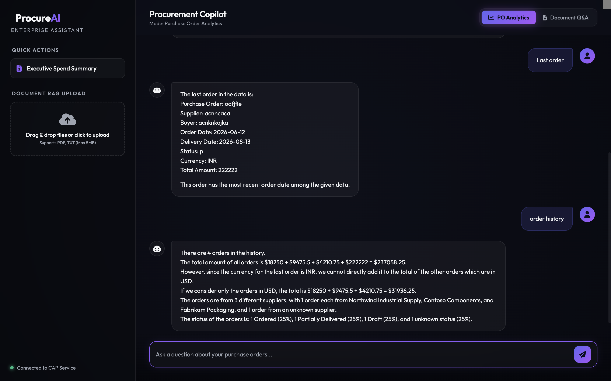

# SAP Enterprise AI Assistant and Procurement MCP Server

Welcome to the **SAP Enterprise AI Assistant** project. This is a Cloud Application Programming (CAP) model application deployed on SAP BTP, integrated with an AI Chat Interface and a custom **Model Context Protocol (MCP)** server to query, search, and analyze SAP procurement data (Purchase Orders, spend summaries, etc.) as well as parse and search uploaded PDF/text documents.

---

## Chat Interface Screenshot

Below is a preview of the Enterprise AI Assistant chat interface:



---

## Key Features

1. **AI Chat Assistant**: A web client interface allowing users to converse with the procurement assistant and ask analytical/document-based questions.
2. **Model Context Protocol (MCP) Server**: A NodeJS MCP Server implementation exposing tools for AI models to query procurement repositories (SQLite/HANA).
3. **Retrieval-Augmented Generation (RAG)**: Document upload endpoint allowing document chunking, embeddings computation, and semantic keyword search.
4. **SAP Procurement Services**: Draft-enabled OData service layer for Purchase Orders and Purchase Order Items matching standard SAP schemas.

---

## MCP Tools Exposed

The MCP server exposes the following tools to standard MCP clients:

*   `search_purchase_orders`: Search purchase orders by PO number, supplier, buyer, status, or date range.
*   `get_purchase_order`: Retrieve a specific purchase order and its associated line items.
*   `get_spend_summary`: Calculate spend analysis by supplier or date range (segregated by currency).
*   `list_late_deliveries`: Identify active, uncompleted purchase orders that have passed their scheduled delivery dates.
*   `search_procurement_documents`: Perform full-text search against uploaded files using keyword relevance.

---

## Project Structure

Following the recommended SAP CAP & MCP project layout:

```text
├── app/                       # UI Frontend applications
│   ├── chat/                  # AI Chat Interface (HTML, CSS, JS)
│   ├── purchase-orders/       # Purchase Orders Fiori/UI5 app
│   └── services.cds           # UI Annotations and Service endpoints exposure
├── db/                        # Domain model and SQLite data storage
│   ├── schema.cds             # Database schema (Documents, Embeddings, ChatHistory, PurchaseOrders)
│   └── data/                  # Mock data for local testing
├── srv/                       # CAP backend service logic
│   ├── chat-service.cds       # OData / Action definitions (askAnalytics, uploadDocument, etc.)
│   └── chat-service.js        # Action implementations (PDF extraction, embedding queries)
└── mcp/                       # Model Context Protocol Server
    ├── server.js              # Express MCP server using Streamable HTTP Transport
    ├── procurement-repository.js # Database CRUD and aggregation queries using cds.QL
    └── tools/
        └── index.js           # Tool schema definitions (Zod) and handlers registration
```

---

## Getting Started

### Prerequisites
*   Node.js (v18+)
*   SAP CAP CLI: Install globally via:
    ```bash
    npm i -g @sap/cds-dk
    ```

### Installation
Clone this repository and install dependencies in the root folder:
```bash
npm install
```

### Running Locally

1.  **Start the SAP CAP Backend & Database**:
    ```bash
    cds watch
    ```
    This initializes the SQLite database, deploys the schemas, loads mock data, and starts the OData server (default port `4004`). You can access the local service page at `http://localhost:4004`.

2.  **Start the MCP Server**:
    In a separate terminal window, run:
    ```bash
    npm run mcp:start
    ```
    This starts the Streamable HTTP MCP Server at `http://localhost:3000/mcp`.

---

## Deployment

Build and package the application into an MTA archive (`.mtar`) for deployment on SAP BTP:

```bash
npm run build
npm run deploy
```
