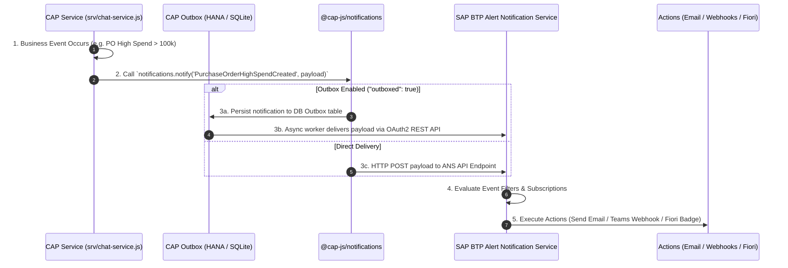

# 🚨 Complete SAP Alert Notification Service (ANS) Lifecycle Guide

This guide details the end-to-end lifecycle of the **SAP Alert Notification Service (ANS)** in the `enterprise-ai-assistant` project, from event definition and template registration to BTP service binding, CAP framework integration, and local mocking.

---

## 🗺️ Architecture Overview & Event Flow



---

## 📌 Phase 1: Declarative Setup & Template Definitions

Before emitting alerts, notification types and templates are registered in the application:

### 1.1 Notification Types Catalog (`srv/notification-types.json`)
Defines notification keys, headers, and localized body templates with dynamic placeholders:
```json
[
  {
    "NotificationTypeKey": "PurchaseOrderHighSpendCreated",
    "NotificationTypeVersion": "1",
    "Templates": [
      {
        "Language": "en",
        "TemplatePublicHeader": "High Spend Purchase Order Created",
        "TemplateSensitiveBody": "A purchase order with high spend {{poID}} ({{amount}} {{currency}}) for supplier {{supplier}} has been created. Please review.",
        "TemplateGroupedHeader": "High Spend Purchase Orders"
      }
    ]
  },
  {
    "NotificationTypeKey": "PurchaseOrderRejected",
    "NotificationTypeVersion": "1",
    "Templates": [
      {
        "Language": "en",
        "TemplatePublicHeader": "Purchase Order Rejected",
        "TemplateSensitiveBody": "Purchase Order {{poID}} has been rejected by buyer {{buyer}}.",
        "TemplateGroupedHeader": "Purchase Order Rejections"
      }
    ]
  }
]
```

### 1.2 CAP Plugin Configuration (`package.json`)
Configures `@cap-js/notifications` to map templates and enable the transactional outbox:
```json
"cds": {
  "requires": {
    "notifications": {
      "types": "srv/notification-types.json",
      "outbox": null,
      "outboxed": true
    }
  }
}
```

---

## 📌 Phase 2: BTP Infrastructure Provisioning & Service Binding

### 2.1 MTA Resource Binding (`mta.yaml`)
Declared as an existing BTP managed service bound to the CAP core service module:
```yaml
modules:
  - name: enterprise-ai-assistant-srv
    requires:
      - name: enterprise-ai-assistant-alert-notification

resources:
  - name: enterprise-ai-assistant-alert-notification
    type: org.cloudfoundry.existing-service
    parameters:
      service-name: EnterpriseAI-Alert
```

### 2.2 Credentials & Service Binding (`default-env.json`)
At runtime, service binding injects OAuth2 client credentials into `VCAP_SERVICES`:
```json
"alert-notification": [
  {
    "name": "enterprise-ai-assistant-alert-notification",
    "plan": "standard",
    "credentials": {
      "url": "https://clm-sl-ans-live-ans-service-api.cfapps.us10.hana.ondemand.com",
      "client_id": "sb-bdb3d5f2-f8a0-4a20-bab5-023ec38b9bc2!b664809|ans-xsuaa!b673",
      "client_secret": "...",
      "oauth_url": "https://665de2a0trial.authentication.us10.hana.ondemand.com/oauth/token?grant_type=client_credentials"
    }
  }
]
```

---

## 📌 Phase 3: Application Event Triggering (`srv/chat-service.js`)

Notifications are dispatched programmatically during business transactions:

### 3.1 High Spend Alert Trigger
```javascript
async function publishAlert(po) {
  try {
    const notifications = await cds.connect.to('notifications');

    await notifications.notify('PurchaseOrderHighSpendCreated', {
      recipients: ['manager@company.com', 'blesswinsj@gmail.com'],
      data: {
        poID: po.purchaseOrder || po.ID,
        supplier: po.supplier || 'N/A',
        amount: po.totalAmount,
        currency: po.currency || 'INR'
      }
    });

    console.log(`[CALESI Notification] High spend alert sent for PO: ${po.purchaseOrder || po.ID}`);
  } catch (error) {
    console.error(`[CALESI Notification Error] ${error.message}`);
  }
}
```

### 3.2 Direct ANS Payload Structure (Legacy/Low-Level API)
If invoking ANS REST API directly:
```json
{
  "eventType": "PurchaseOrderHighSpendCreated",
  "eventTimestamp": 1723185000,
  "severity": "HIGH",
  "category": "ALERT",
  "subject": "High Spend PO Alert",
  "body": "Purchase Order PO-9901 exceeded threshold.",
  "resource": {
    "resourceName": "EnterpriseAIAssistant",
    "resourceType": "Application"
  }
}
```

---

## 📌 Phase 4: SAP BTP Processing & Action Routing

Once the alert reaches SAP BTP ANS, the platform processes it according to cockpit rules:

1. **Ingress Validation**: Validates client OAuth2 access token.
2. **Rule & Subscription Matching**: Evaluates incoming `eventType`, `severity`, and `resourceName`.
3. **Action Execution**: Delivers notifications via configured subscription channels:
   * 📧 **Email**: Sends formatted emails to `recipients`.
   * 💬 **Slack / Microsoft Teams**: Sends webhook messages.
   * 📱 **SAP Fiori Launchpad**: Pushes notification badges to user notification center.
   * 🎫 **ServiceNow / Jira**: Creates tickets automatically.

---

## 📌 Phase 5: Outbox Pattern & Resilience ("outboxed": true)

To prevent notification loss during network outages or service downtime:
1. CAP writes notifications to a local transactional **Outbox Table** in the database (`db.sqlite` / SAP HANA).
2. The event commit is coupled atomically with the business entity update (e.g., PO status change).
3. A background process asynchronously flushes outboxed items to ANS once network connectivity is verified.

---

## 📌 Phase 6: Local Development & Emulation (`srv/mock-alert-service.js`)

For local offline development (`cds watch`), a custom mock service intercepts alert requests:

```javascript
const cds = require('@sap/cds');

class MockAlertService extends cds.Service {
  async init() {   
    this.on('POST', '*', (req) => {
      console.log("--- ALERT NOTIFICATION ---");
      console.log(JSON.stringify(req.data, null, 2));
      console.log("--------------------------");
      return { status: 'Sent (Mocked)' };
    });
    await super.init();
  }
}

module.exports = MockAlertService;
```

---

## 📊 Summary Lifecycle Matrix

| Phase | File / Service | Primary Responsibility |
| :--- | :--- | :--- |
| **1. Template Registration** | `srv/notification-types.json` | Declare notification keys, localized headers, and dynamic message bodies. |
| **2. Plugin Config** | `package.json` | Configure `@cap-js/notifications` & transactional outbox settings. |
| **3. BTP Provisioning** | `mta.yaml` & `default-env.json` | Bind `EnterpriseAI-Alert` existing service & OAuth credentials. |
| **4. Event Execution** | `srv/chat-service.js` | Trigger `notifications.notify(...)` when business rules breach. |
| **5. Outbox Delivery** | `@cap-js/notifications` Outbox | Persist and retry pending notifications asynchronously. |
| **6. BTP Action Routing** | SAP BTP ANS Cockpit Engine | Execute emails, webhooks, and Fiori notifications. |
| **7. Local Emulation** | `srv/mock-alert-service.js` | Log notifications to stdout during local developer testing. |
