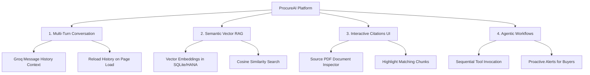

# 🚀 Proposals to Elevate ProcureAI to the Next Level

This document details four high-impact architectural and user experience proposals to transform **ProcureAI** from a prototype into a state-of-the-art, production-ready enterprise assistant.

---

## 🗺️ Summary of Proposals



---

## 💬 1. Multi-Turn Conversation Context & Session Persistence

### Current Limitation
- The chat interface is strictly **single-turn**. For example, if a user asks *"Who is the supplier for PO 10001?"* and follows up with *"Show me their late deliveries"*, the LLM has no context of the previous turn and cannot resolve *"their"*.
- On page reload, the conversation history is cleared from the UI, despite being saved to the database.

### The Plan
1. **Frontend Persistence**: Fetch historical chats from `/chat/ChatHistory` on page load and render them in the UI.
2. **Context-Aware Groq Backend**: Query the last 5 messages from `ChatHistory` and prepend them as conversation history in the API call to Groq.

### 📝 Code Blueprints

#### srv/chat-service.js (Multi-turn Context Backend)
```javascript
// Add query history retrieval inside askAnalytics / askDocument
const history = await tx.run(
  SELECT.from(ChatHistory)
    .where({ feature: currentFeature })
    .orderBy('timestamp desc')
    .limit(5)
);

// Map history to standard chat roles (oldest first)
const messagesContext = history.reverse().flatMap(h => [
  { role: 'user', content: h.userQuestion },
  { role: 'assistant', content: h.aiResponse }
]);

// Final payload to Groq
const messages = [
  { role: 'system', content: systemPrompt },
  ...messagesContext,
  { role: 'user', content: question }
];
```

#### app/chat/app.js (UI Page Restore)
```javascript
async function loadChatHistory() {
  try {
    const res = await fetch('/chat/ChatHistory?$orderby=timestamp asc');
    if (!res.ok) return;
    const data = await res.json();
    data.value.forEach(chat => {
      addMessage(chat.feature === 'rag' ? 'bot' : 'bot', chat.aiResponse, chat.userQuestion);
    });
  } catch (err) {
    showToast('Failed to load chat history', 'error');
  }
}
```

---

## 🧠 2. Semantic Vector Search (True RAG Engine)

### Current Limitation
- Document search uses a simple SQL `LIKE` substring filter. If a user asks about "shipping guidelines", but the document uses the word "transportation instructions", the search finds nothing.
- The `embedding` column in the `Embeddings` table is hardcoded to `'[]'`.

### The Plan
1. **Vector Schema Migration**: Redefine the `Embeddings` entity in `schema.cds` using `@cap-js/sqlite` or `@cap-js/hana` native Vector types.
2. **Embedding Generation**: Integrate an embedding API (e.g., a free HuggingFace endpoint or OpenAI text-embedding-3-small) inside `uploadDocument`.
3. **Similarity Query**: Replace the substring filter in `askDocument` with a vector distance query (`COSINE_SIMILARITY`).

### 📝 Code Blueprints

#### db/schema.cds (Vector definition)
```cds
entity Embeddings {
  key ID         : UUID;
      documentID : UUID not null;
      document   : Association to Documents on document.ID = documentID;
      chunkText  : LargeString not null;
      chunkIndex : Integer not null;
      // Define vector datatype with 1536 dimensions (for OpenAI standard)
      embedding  : Vector(1536); 
}
```

#### srv/chat-service.js (Cosine Similarity Query)
```javascript
// Calculate query vector first using the Embedding API
const queryVector = await getEmbedding(question);

// Execute native cosine similarity using CAP's query dialect
const chunks = await tx.run(
  SELECT.from(Embeddings)
    .columns('chunkText', 'chunkIndex', 'document.fileName')
    .orderBy`cosine_similarity(embedding, ${queryVector}) desc`
    .limit(5)
);
```

---

## 📄 3. Interactive Document Viewer & Source Citations

### Current Limitation
- Answers generated via Document Q&A do not specify which file or part of the file they were extracted from.
- Users cannot browse or preview uploaded files without looking at database logs.

### The Plan
1. **Citation Tags**: Modify the backend to return JSON structures or markdown references containing document names and chunk indexes (e.g., `[^1: procurement_policy.pdf]`).
2. **Interactive Side-Panel**: Introduce an expandable document viewer on the right side of the chat interface. When a user clicks a citation link in the chat bubble, the side-panel expands and scrolls to highlight that specific chunk of text.

### 🎨 UI Design Concept
```
+------------------+------------------------------+--------------------+
|   Sidebar        |      Chat Area               | Document Viewer    |
|                  |                              |                    |
| > Summary        | Bot: According to policy...  | [procurement.pdf]  |
|                  | [See policy_2026.pdf - Ch 3] |                    |
| > Upload files   |           ^                  | (Highlight)        |
|                  |   (Clicking scrolls viewer)  | "All orders over   |
|                  |                              | $50K require CFO   |
|                  |                              | approval..."       |
+------------------+------------------------------+--------------------+
```

---

## 🤖 4. Autonomous Agentic Workflows & Multi-Agent Collaboration

### Current Limitation
- The assistant is passive. It only answers direct questions and requires the user to select the appropriate mode manually.

### The Plan
- **Orchestration Agent**: Replace the hardcoded mode toggle with an LLM Router that automatically decides whether a query needs Document RAG, SQL database aggregation, or both.
- **Autonomous Tool Calling**: Instead of querying all POs into Groq's context window, let the LLM call the custom MCP tools sequentially to fetch precise data subsets, perform calculations, and format findings.
- **Proactive Alerts**: Schedule background worker processes (using the CAP scheduler) that search for overdue items and trigger warnings dynamically.

---

## 🛠️ Recommended Action Plan

To implement these enhancements efficiently:
1. **To align on UI design details**: Run the `/grill-me` command in chat to answer questions regarding layout design preferences.
2. **To coordinate multi-file changes**: Use `/teamwork-preview` to inspect how a set of specialized subagents can concurrently refactor the database schema, backend services, and front-end interface.
3. **To run automated feature implementation**: Use the `/goal` command, specifying:
   > *"Deploy true vector embeddings search locally using @cap-js/sqlite, and add a sidebar panel to preview uploaded documents."*
