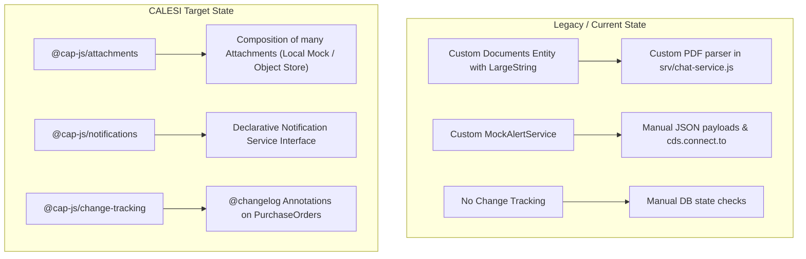

# CALESI Refactoring Manual for Enterprise AI Assistant

This manual provides a step-by-step guide to refactor the `enterprise-ai-assistant` codebase from custom service glue code to **CALESI (CAP-level Service Interfaces)** patterns and `@cap-js` plugins.

---

## 🎯 Architecture Overview



---

## 🛠️ Step 1: Refactor Attachments to `@cap-js/attachments`

### 1.1 Install Plugin
Run the following command to add the CALESI Attachments plugin:
```bash
npm add @cap-js/attachments
```

### 1.2 Update Database Schema (`db/schema.cds`)
Replace the raw `LargeString` in `Documents` with the CALESI `Attachments` composition.

```diff
 namespace enterprise.ai;
+using { Attachments } from '@cap-js/attachments';

-entity Documents {
-  key ID         : UUID;
-      fileName   : String(200) not null;
-      content    : LargeString not null;
-      uploadedAt : DateTime;
-      fileType   : String(50);
-}
+entity Documents {
+  key ID          : UUID;
+      fileName    : String(200) not null;
+      uploadedAt  : DateTime;
+      fileType    : String(50);
+      attachments : Composition of many Attachments; // CALESI Service Interface
+}
```

### 1.3 Benefits of this change:
* **Local Mode:** Automatically stores binaries locally on disk when running `cds watch`.
* **Production Mode:** Automatically streams file uploads directly to SAP BTP Object Store / Document Management Service (DMS) without custom stream code.

---

## 🔔 Step 2: Refactor Notifications to `@cap-js/notifications`

### 2.1 Install Plugin
```bash
npm add @cap-js/notifications
```

### 2.2 Refactor `package.json` Config
Replace the manual mock configuration in `package.json`:

```diff
-      "alert-notification": {
-        "kind": "rest",
-        "[development]": {
-          "impl": "./srv/mock-alert-service.js"
-        },
-        "credentials": {
-          "forwardAuthToken": false
-        }
-      }
+      "notifications": {
+        "kind": "alert-notification"
+      }
```

### 2.3 Refactor Notification Publishing Code (`srv/chat-service.js`)

Replace manual `cds.connect.to('alert-notification')` with the standard CALESI Notification API:

```javascript
// Before CALESI (Legacy):
// await alertService.send('POST', '/', payload);

// After CALESI (Standardized Interface):
const notifications = await cds.connect.to('notifications');

await notifications.notify('PurchaseOrderHighSpendCreated', {
  recipients: ['manager@company.com'],
  data: {
    poID: po.purchaseOrder || po.ID,
    supplier: po.supplier,
    amount: po.totalAmount,
    currency: po.currency
  }
});
```

---

## 📜 Step 3: Add Change Tracking to Purchase Orders (`@cap-js/change-tracking`)

### 3.1 Install Plugin
```bash
npm add @cap-js/change-tracking
```

### 3.2 Add Annotations (`srv/chat-service.cds`)
Annotate fields in `PurchaseOrders` to enable automatic change tracking without writing custom database triggers or audit tables:

```cds
using { enterprise.ai as db } from '../db/schema';

annotate db.PurchaseOrders with @changelog: [
    supplier,
    status,
    totalAmount,
    deliveryDate
] {
    supplier    @changelog;
    status      @changelog;
    totalAmount @changelog;
};
```

---

## 🧪 Verification & Testing Plan

1. **Start the local server:**
   ```bash
   cds watch
   ```
2. **Test Local Attachments:**
   Upload files via the OData endpoint or Fiori UI. Verify files are managed by `@cap-js/attachments` local provider without crashing or requiring manual stream buffers.
3. **Test Notifications:**
   Create a Purchase Order with `totalAmount > 100000` and confirm the CALESI notification logger outputs formatted notification events.
4. **Test Audit Trail:**
   Update the `status` of a Purchase Order to `Approved` or `Rejected` and query the automatically generated `ChangeHistory` view.

---

## 📊 Summary of Refactoring Impact

| Component | Legacy Code (Current) | CALESI Refactored Code |
| :--- | :--- | :--- |
| **File Storage** | Manual `LargeString` DB columns & manual Base64 parsing | `@cap-js/attachments` plugin & `Composition of Attachments` |
| **Alert Service** | Custom `mock-alert-service.js` with manual `POST` payload logic | `@cap-js/notifications` standard CALESI event notification contract |
| **Audit Logging** | Unmonitored / manual log output | `@cap-js/change-tracking` with `@changelog` annotations |
| **Cloud Deployment** | Complex manual `mta.yaml` resource bindings | Automated platform service binding managed by CAP runtime |
