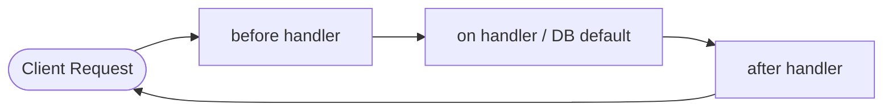

# 🚀 Mastering SAP CAP Application Services (`cds.ApplicationService`)

To master **Application Services** in the **SAP Cloud Application Programming Model (CAP)**, you need to understand both the underlying framework architecture and practical enterprise patterns.

Below is a structured roadmap from foundational concepts to advanced production techniques.

---

## 📌 Phase 1: Core Lifecycle & Class Implementation

### Key Concepts to Learn
- **Class-Based vs Function-Based Implementation**:
  - Legacy approach: `cds.service.impl(async function() { ... })`
  - Modern ES6 class approach: `class MyService extends cds.ApplicationService { async init() { ... } }`
- **Service Lifecycle**:
  - Overriding `async init()` and calling `await super.init()`.
  - Service bootstrapping and registration in `cds.services`.
- **Connecting to Services**:
  - Using `cds.connect.to('ServiceName')` to consume local or remote services.

### Code Pattern
```javascript
const cds = require('@sap/cds');

class ChatService extends cds.ApplicationService {
  async init() {
    // Register handlers before calling super.init()
    this.before('CREATE', 'PurchaseOrders', this.onBeforeCreateOrder);
    this.on('askAnalytics', this.onAskAnalytics);

    return super.init(); // Essential: initializes framework default handlers
  }

  async onBeforeCreateOrder(req) {
    if (!req.data.supplier) req.reject(400, 'Supplier is required');
  }

  async onAskAnalytics(req) {
    const { question } = req.data;
    // Custom logic...
    return `Answer for: ${question}`;
  }
}

module.exports = ChatService;
```

---

## 📌 Phase 2: The CAP Event Pipeline (`before`, `on`, `around`, `after`)

### Key Concepts to Learn
1. **`before` phase**:
   - Validation, input sanitization, checking prerequisites.
   - Using `req.reject()` or `req.error()` to stop execution.
2. **`on` phase**:
   - Replacing or providing custom execution logic for CRUD (`READ`, `CREATE`, `UPDATE`, `DELETE`) or custom actions/functions.
3. **`around` phase**:
   - Intercepting the request flow before and after delegation (`await next()`).
   - Useful for telemetry, profiling, custom transactions.
4. **`after` phase**:
   - Post-processing query results (enriching payloads, masking sensitive data, audit logging).

### Execution Flow


---

## 📌 Phase 3: Data Access & Transaction Management (`cds.ql` & `cds.tx`)

### Key Concepts to Learn
- **Fluent Query Language (`cds.ql`)**:
  - `SELECT`, `INSERT`, `UPDATE`, `DELETE` constructs.
  - Expanding associations: `SELECT.from(PurchaseOrders).columns(p => { p.purchaseOrder, p.items(i => { i.itemNumber }) })`.
- **Transaction Propagation (`cds.tx`)**:
  - `req.tx`: Accessing the current request transaction.
  - `cds.tx(req).run(...)`: Running queries strictly within the caller's database transaction context.
  - Independent transactions: `cds.tx(async tx => { ... })` for decoupled background work.

---

## 📌 Phase 4: Custom Actions & Functions

### Key Concepts to Learn
- **Bound vs Unbound Operations**:
  - **Unbound**: Service-level actions (e.g., `action askAnalytics(question: String)`).
  - **Bound**: Entity-level actions (e.g., `action approve()` bound to a specific `PurchaseOrders` instance).
- **Request Inspection (`req`)**:
  - Accessing `req.data`, `req.params`, `req.user`, `req.headers`, `req.target`.
  - Managing file streams / blob payloads.

---

## 📌 Phase 5: Draft Handling & Fiori State Transitions

### Key Concepts to Learn
- **`@odata.draft.enabled` Lifecycle**:
  - Draft creation (`NEW`), draft editing (`EDIT`), draft validation (`draftPrepare`), draft activation (`SAVE`).
- **Draft Handlers**:
  - Hooking into `this.before('SAVE', ...)` to enforce final constraints before a draft turns into active data.
  - Side-effect calculations (updating total amounts automatically during draft edits).

---

## 📌 Phase 6: Security, Tenant Isolation & Multi-Tenancy

### Key Concepts to Learn
- **Declarative Authorization**:
  - Using `@requires` and `@restrict` annotations in CDS definitions.
- **Programmatic Security**:
  - `req.user.is('Manager')`
  - Accessing user attributes: `req.user.attr.CostCenter`.
- **Multi-Tenant Scoping**:
  - Tenant propagation (`req.tenant`).
  - Schema switching in multi-tenant environments using `@sap/cds-mtxs`.

---

## 📌 Phase 7: External Integrations & Event-Driven Architecture

### Key Concepts to Learn
- **Consuming External OData/REST APIs**:
  - Configuring `package.json` destination bindings.
  - Forwarding user context / bearer tokens to downstream services via `@sap-cloud-sdk`.
- **Asynchronous Messaging**:
  - Emitting domain events: `this.emit('OrderCreated', { orderID: po.ID })`.
  - Subscribing to Cloud Events via SAP Event Mesh / Redis / Kafka.

---

## 🎯 Recommended Learning Steps Summary

| Step | Topic | Goal |
|---|---|---|
| 1 | **Class Inheritance** | Refactor legacy `cds.service.impl` functions into `class extends cds.ApplicationService`. |
| 2 | **Event Pipeline Mastery** | Write custom `before`, `on`, and `after` hooks for CRUD and custom actions. |
| 3 | **`cds.ql` & Transactions** | Perform complex relational queries and handle multi-step database transactions with `req.tx`. |
| 4 | **Input Validation & Errors** | Master `req.error()` field targeting for UI validation badges. |
| 5 | **Security & Roles** | Implement programmatic role checks using `req.user`. |
| 6 | **Outbound Integrations** | Connect services using `cds.connect.to()` and handle async events with `this.emit()`. |
