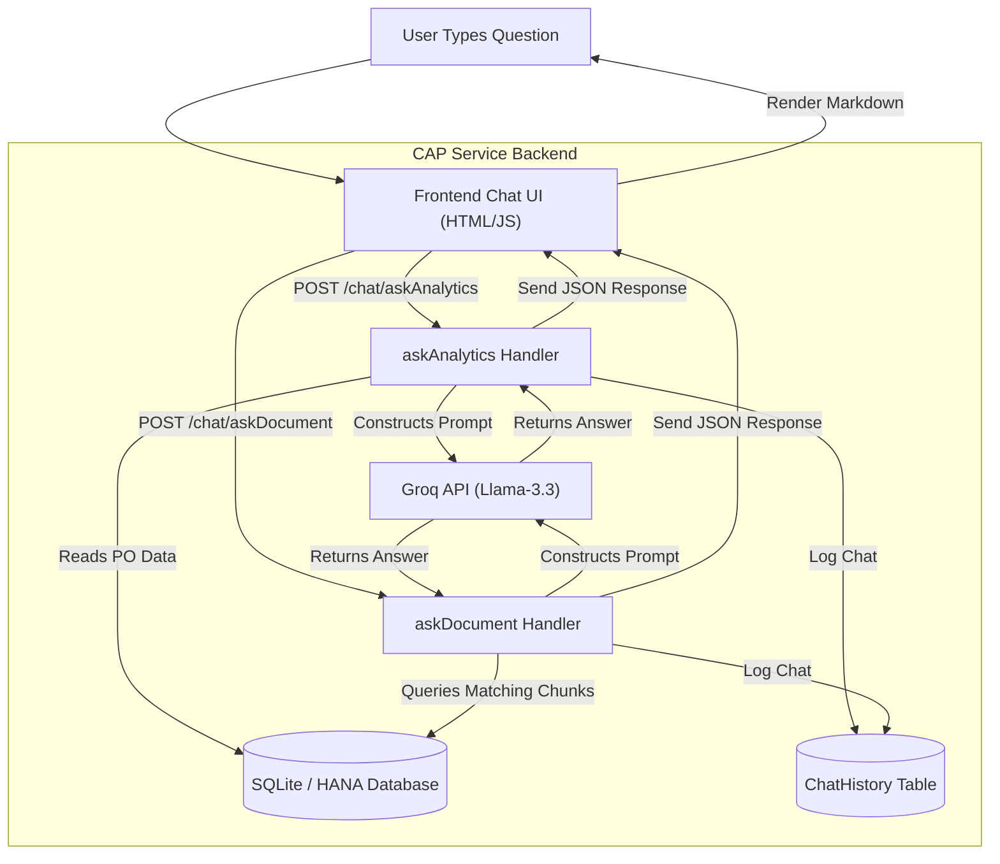

# ProcureAI Chatbot Architecture & Request Flow

This document details the end-to-end flow of how the ProcureAI Chatbot processes user queries, starting from the User Interface (UI) down to the backend services, databases, and the LLM, and back.

---

## 1. System Architecture

Below is a diagram of the components and how data flows between them during a query:

---

## 2. Step-by-Step Execution Flows

Depending on the mode selected in the UI, the chatbot follows one of two distinct request pipelines:

### Pipeline A: Purchase Order Analytics Mode

When the user asks a question like *"What is the total spend?"*:

1. **Start (UI Entry):** 
   - The user enters a question. The frontend logic in [app.js](file:///home/user/projects/enterprise-ai-assistant/app/chat/app.js) identifies that the active mode is `analytics`.
   - It sends an HTTP `POST` request to `/chat/askAnalytics` with the body: `{"question": "..."}`.

2. **CAP Service Connection:**
   - The CAP server routes the request to the `askAnalytics` custom event handler in [chat-service.js](file:///home/user/projects/enterprise-ai-assistant/srv/chat-service.js).

3. **Data Retrieval:**
   - The handler runs a SQL `SELECT *` query against the `PurchaseOrders` table in the database (`db.sqlite` or SAP HANA).
   - The raw rows of purchase order data are formatted into a JSON context string.

4. **Prompt Construction:**
   - The service builds a system prompt containing the live purchase order context, instructing the model to act as a procurement analytics expert.

5. **LLM Orchestration:**
   - The prompt and question are sent via an HTTP POST request to the **Groq API** (`llama-3.3-70b-versatile`).

6. **History Logging:**
   - The generated response is saved to the `ChatHistory` database table along with the user's question, timestamp, and a `Analytics` feature tag.

7. **End (UI Presentation):**
   - The CAP service returns the answer string as JSON.
   - The frontend parses the text as Markdown and displays it to the user.

---

### Pipeline B: Document Q&A Mode (RAG)

When the user asks a question like *"When is dual approval required?"*:

1. **Start (UI Entry):**
   - The user enters a question. The frontend identifies that the active mode is `document`.
   - It sends an HTTP `POST` request to `/chat/askDocument` with the body: `{"question": "..."}`.

2. **CAP Service Connection:**
   - The CAP server routes the request to the `askDocument` custom handler in [chat-service.js](file:///home/user/projects/enterprise-ai-assistant/srv/chat-service.js).

3. **Keyword Search & Database Retrieval:**
   - The handler cleans the question, filters out stop-words (like *what*, *when*, *is*, etc.), and extracts the remaining search terms.
   - It runs an `OR`-based `LIKE` query against the `Embeddings` table to find matching text chunks.
   - The top 5 text segments are aggregated to form the search context.

4. **Prompt Construction:**
   - The service constructs a system prompt containing the document excerpts, instructing the model to answer using *only* this context.

5. **LLM Orchestration:**
   - The prompt is sent to the **Groq API** to perform Retrieval-Augmented Generation (RAG).

6. **History Logging:**
   - The response is saved to the `ChatHistory` table with the `rag` feature tag.

7. **End (UI Presentation):**
   - The answer is returned to the frontend, parsed as Markdown, and rendered for the user.
