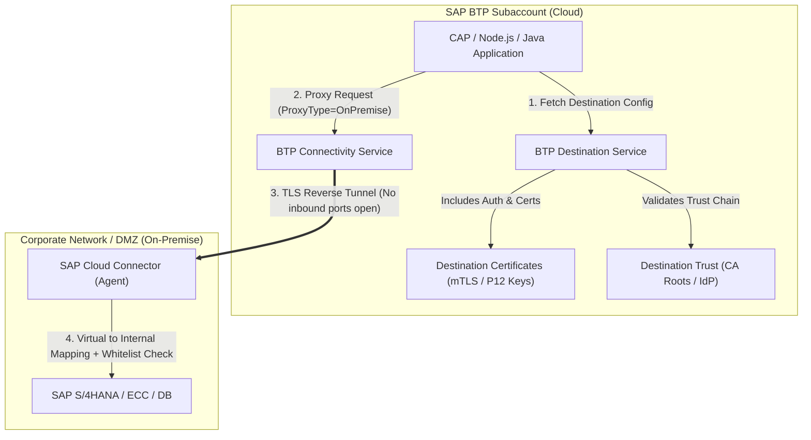
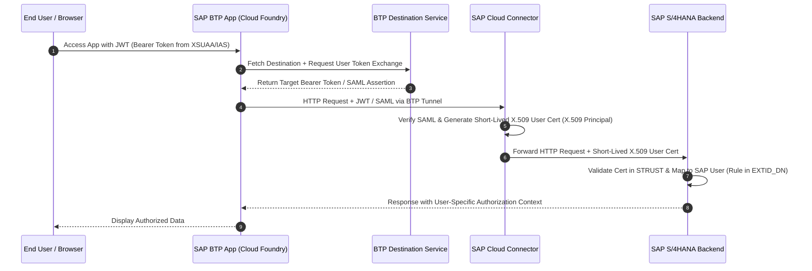

# SAP BTP Connectivity Suite: Ultimate Architecture & Mastery Guide

## Executive Summary
In the SAP Business Technology Platform (BTP) ecosystem, **Connectivity** is the backbone that enables cloud-native applications, extensions, and integration flows to securely interact with on-premise SAP systems (S/4HANA, ECC, BW), cloud SaaS solutions (SuccessFactors, Ariba, Salesforce), and third-party APIs.

This guide covers the 5 core pillars of SAP BTP Connectivity found in the SAP BTP Cockpit:
1. **Connectivity Service**
2. **Destinations**
3. **Destination Certificates**
4. **Destination Trust**
5. **SAP Cloud Connector (SCC)**

---

## 1. Core Architecture & Breakdown of the 5 Pillars



---

### Pillar 1: Connectivity (BTP Connectivity Service)
* **What it is**: The cloud-side proxy service hosted on SAP BTP.
* **Primary Function**: It establishes and manages the secure TLS reverse tunnel connected to the on-premise SAP Cloud Connector. It routes cloud HTTP/RFC requests directed to `ProxyType = OnPremise` through this secure tunnel.
* **Why it matters**: It enables cloud applications to call endpoints inside private corporate networks without needing public IP addresses, site-to-site VPNs, or exposing corporate firewall ports inbound.

---

### Pillar 2: Destinations (BTP Destination Service)
* **What it is**: A centralized configuration repository in SAP BTP (at Subaccount or Service Instance level) that decouples target backend connection details from application source code.
* **Key Configuration Parameters**:

| Parameter | Options / Description | Example |
| :--- | :--- | :--- |
| `Name` | Unique identifier used in application code | `S4HANA_ONPREM` |
| `Type` | `HTTP`, `RFC`, `MAIL`, `LDAP` | `HTTP` |
| `URL` | Target address (Virtual host for OnPremise, HTTPS URL for Internet) | `http://s4hana-virtual:8000` |
| `ProxyType` | `Internet` or `OnPremise` | `OnPremise` |
| `Authentication` | `NoAuthentication`, `BasicAuthentication`, `PrincipalPropagation`, `OAuth2SAMLBearerAssertion`, `OAuth2ClientCredentials`, `OAuth2UserTokenExchange`, `ClientCertificateAuthentication` | `PrincipalPropagation` |
| `Location ID` | Identifier matching a specific Cloud Connector instance (optional for multi-SCC setups) | `LOCATION_BERLIN` |

* **Additional Properties**:
  * `WebIDEEnabled` = `true` (Enables consumption in SAP Business Application Studio)
  * `HTML5.DynamicDestination` = `true` (Allows frontend routing via Managed Approuter)
  * `sap-client` = `100` (Specifies SAP client number)

---

### Pillar 3: Destination Certificates
* **What it is**: A secure keystore stored inside the BTP Destination Service used to manage client digital X.509 certificates (`.p12`, `.pfx`, or `.jks` files).
* **Primary Use Cases**:
  1. **Mutual TLS (mTLS)**: Used when an external API or target system requires client certificate authentication (`Authentication = ClientCertificateAuthentication`).
  2. **OAuth2 SAML Bearer Assertion**: Signing digital SAML tokens exchanged with SAP backend systems or identity providers without embedding private keys in source code.
* **Key Advantage**: Certificates can be rotated centrally in the BTP Cockpit without restarting or redeploying your cloud applications.

---

### Pillar 4: Destination Trust
* **What it is**: The trust management framework that defines trusted Certificate Authorities (CAs) and Identity Providers (IdP) for outbound connections.
* **Primary Use Cases**:
  1. **Server Certificate Trust**: Validates target HTTPS server SSL certificates. If the target server uses a private enterprise CA certificate, that CA root certificate must be trusted by the subaccount.
  2. **Principal Propagation Trust**: Verifies the trust chain when converting cloud user JWT tokens (from SAP Cloud Identity Services / IAS) into SAML assertions or X.509 certificates for single sign-on (SSO).

---

### Pillar 5: SAP Cloud Connector (SCC)
* **What it is**: A lightweight on-premise agent installed inside the corporate network (DMZ or server VLAN).
* **Key Features & Functions**:

```
+-----------------------------------------------------------------------+
|                       SAP CLOUD CONNECTOR                             |
+-----------------------------------------------------------------------+
|  1. Outbound Reverse Tunnel | Establishes outbound connection (port 443)|
|                             | to BTP. Zero inbound firewall ports.   |
|-----------------------------+-----------------------------------------|
|  2. Virtual-to-Internal     | Maps "s4hana-virtual:8000" to          |
|     Mapping                 | "10.0.4.15:8001" (masks real infrastructure)|
|-----------------------------+-----------------------------------------|
|  3. Fine-Grained Access     | Whitelists specific URL paths e.g.      |
|     Control (Whitelisting)  | /sap/opu/odata/sap/API_BUSINESS_PARTNER |
|-----------------------------+-----------------------------------------|
|  4. Principal Propagation   | Maps Cloud User (e.g. john@corp.com) to |
|                             | SAP Backend User (e.g. JDOE) via X.509   |
+-----------------------------------------------------------------------+
```

---

## 2. Deep-Dive: Principal Propagation Architecture

Principal Propagation allows a user logged into a cloud application (via SAP IAS or IdP) to be seamlessly authenticated in the SAP backend (S/4HANA / ECC) under their own backend user identity **without re-entering credentials or sending passwords over the wire**.



---

## 3. Hands-On Configuration Guide

### Step 1: Pair Cloud Connector with BTP Subaccount
1. Log into your local Cloud Connector administrator UI (`https://localhost:8443`).
2. Click **Add Subaccount**.
3. Fill in details:
   * **Region**: Select your BTP region (e.g., `cf-eu10` / `cf-us10`).
   * **Subaccount ID**: Copy from BTP Cockpit Overview page.
   * **Subaccount User / Password**: Your SAP BTP user or technical deployment user.
   * **Location ID**: (Optional) e.g., `ONPREM_HEADQUARTERS`.

### Step 2: Configure System Mapping in Cloud Connector
1. Select your connected Subaccount in SCC -> **Cloud To On-Premise**.
2. Click **+ (Add System Mapping)**:
   * **Back-end Type**: `ABAP System` (or `Non-SAP System`).
   * **Protocol**: `HTTP` or `HTTPS`.
   * **Internal Host & Port**: `10.20.30.40 : 8000` (Actual IP/Host in corporate network).
   * **Virtual Host & Port**: `s4hana-virtual : 8000` (Exposed to Cloud BTP).
   * **Principal Propagation**: Select `Path to Certificate` if using Principal Propagation.
3. Under **Resources Accessible**:
   * Add URL Path: `/sap/opu/odata/sap/`
   * Access Mode: `Path and all sub-paths`.

### Step 3: Create Destination in BTP Cockpit
1. Navigate to **BTP Cockpit -> Subaccount -> Connectivity -> Destinations**.
2. Click **New Destination** and configure:
   ```ini
   Name=S4HANA_ONPREM
   Type=HTTP
   URL=http://s4hana-virtual:8000
   ProxyType=OnPremise
   Authentication=PrincipalPropagation
   LocationID=ONPREM_HEADQUARTERS
   sap-client=100
   WebIDEEnabled=true
   HTML5.DynamicDestination=true
   ```
3. Click **Save** and then **Check Connection** (Should return `200 OK` or `302 Found`).

### Step 4: Application Code Integration (CAP / Node.js)

#### 1. Bind Services in `mta.yaml`
```yaml
modules:
  - name: my-cap-service-srv
    type: nodejs
    path: gen/srv
    requires:
      - name: uaa_my-cap-service
      - name: dest_my-cap-service
      - name: conn_my-cap-service

resources:
  - name: dest_my-cap-service
    type: org.cloudfoundry.managed-service
    parameters:
      service: destination
      service-plan: lite

  - name: conn_my-cap-service
    type: org.cloudfoundry.managed-service
    parameters:
      service: connectivity
      service-plan: lite
```

#### 2. Consume Destination in CAP Logic (`srv/service.js`)
```javascript
const cds = require('@sap/cds');

module.exports = cds.service.impl(async function() {
    const s4hana = await cds.connect.to('S4HANA_ONPREM');

    this.on('READ', 'BusinessPartners', async (req) => {
        // Automatically handles ProxyType=OnPremise, JWT propagation, and Cloud Connector routing
        return s4hana.tx(req).run(req.query);
    });
});
```

---

## 4. Troubleshooting & Diagnostic Cheatsheet

| Issue / Error Message | Root Cause | Solution |
| :--- | :--- | :--- |
| `403 Forbidden` / `Service Unavailable` | Cloud Connector mapping or URL resource path not whitelisted | Check SCC **Cloud to On-Premise -> Resources Accessible**. Ensure URL path `/sap/opu/odata/...` is allowed. |
| `503 Service Unavailable` (Tunnel not connected) | Cloud Connector is disconnected or incorrect Location ID | Verify SCC subaccount status is `Connected`. Check if `Location ID` in Destination matches SCC. |
| `PKIX path building failed: unable to find valid certification path` | Target HTTPS certificate is not trusted by BTP or SCC | Import the server's Root CA certificate into **Destination Trust / Subaccount Trust Store** or SCC Trust Store. |
| `401 Unauthorized` during Principal Propagation | Certificate mapping missing in backend or short-lived cert expired | Check SAP backend transaction `EXTID_DN` mapping rules and verify SCC CA certificate in transaction `STRUST`. |
| `Destination not found` | Service binding missing or destination name mismatch | Verify MTA resource binding (`destination` service) and check destination name spelling in `package.json` / code. |

---

## 5. Mastery Roadmap & Best Practices

To achieve complete mastery of SAP BTP Connectivity:

1. **Architecture Level**:
   * Understand the difference between `ProxyType=Internet` (Cloud-to-Cloud) and `ProxyType=OnPremise` (Cloud-to-OnPremise via SCC).
   * Master OAuth2 flows: `OAuth2SAMLBearerAssertion` vs `OAuth2UserTokenExchange` vs `OAuth2ClientCredentials`.

2. **Security & Operations Level**:
   * Implement **High Availability (HA)** in Cloud Connector (Master / Shadow installation).
   * Implement automated certificate rotation using Destination Certificates for mTLS endpoints.
   * Restrict access paths in SCC to strictly required OData APIs (Least Privilege Principle).

3. **Development Level**:
   * Use `@sap-cloud-sdk/connectivity` and SAP CAP framework to leverage built-in destination caching, tenant isolation, and automatic header propagation.
