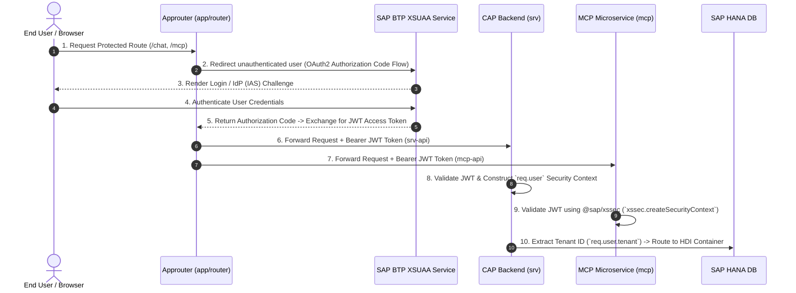

# 🔒 Complete XSUAA Lifecycle Guide in Enterprise AI Assistant

This document details the **complete 7-phase lifecycle of SAP Extended Services for User Authentication and Authorization (XSUAA)** in the `enterprise-ai-assistant` project.

---

## 🗺️ Architecture Overview & Token Flow



---

## 📌 Phase 1: Declarative Security Configuration

Before deployment, security requirements, scopes, and role templates are declared in project configuration files:

### 1.1 Security Descriptor (`xs-security.json`)
Defines application security settings consumed by BTP during XSUAA service creation:
```json
{
  "scopes": [],
  "attributes": [],
  "role-templates": [],
  "authorities-inheritance": false
}
```

### 1.2 Framework Security Configuration (`package.json`)
Defines the authentication profile for `@sap/cds`:
```json
"cds": {
  "requires": {
    "auth": "mocked",             // Default for local development
    "[production]": {
      "auth": "xsuaa",            // Enables @sap/xssec JWT validation in production
      "db": "hana"
    }
  }
}
```
* **Core Security Dependencies**: `@sap/xssec` (v4) and `@sap/xsenv` (v6.2.1).

---

## 📌 Phase 2: Infrastructure Provisioning & MTA Deployment

During build and deployment (`mbt build` -> `cf deploy`), XSUAA resources are provisioned on SAP BTP Cloud Foundry:

### 2.1 MTA Service Resource Definition (`mta.yaml`)
```yaml
resources:
  - name: enterprise-ai-assistant-auth
    type: org.cloudfoundry.managed-service
    parameters:
      service: xsuaa
      service-plan: application
      path: ./xs-security.json
      config:
        xsappname: enterprise-ai-assistant-${org}-${space}
        tenant-mode: dedicated
        oauth2-configuration:
          credential-types:
            - binding-secret
            - x509
          redirect-uris:
            - https://*~{app-api/app-uri}/**
```

### 2.2 Module Service Bindings
The `enterprise-ai-assistant-auth` instance is injected into bound modules via `VCAP_SERVICES`:
* `enterprise-ai-assistant-srv` (CAP Core Service)
* `enterprise-ai-assistant-mcp` (MCP Microservice)
* `enterprise-ai-assistant` (Managed Approuter)

---

## 📌 Phase 3: Ingress Gateway Authentication (Approuter Flow)

All incoming client traffic passes through the Standalone Approuter module (`app/router`):

### 3.1 Route Authentication Strategy (`app/router/xs-app.json`)
Routes enforce XSUAA authentication (`"authenticationType": "xsuaa"`):
```json
{
  "welcomeFile": "/enterpriseaipurchaseorders/index.html",
  "authenticationMethod": "route",
  "routes": [
    {
      "source": "^/mcp(.*)$",
      "destination": "mcp-api",
      "authenticationType": "xsuaa"
    },
    {
      "source": "^/chat/(.*)$",
      "destination": "srv-api",
      "authenticationType": "xsuaa"
    }
  ]
}
```

### 3.2 Token Acquisition & Forwarding
* Approuter coordinates OAuth2 authorization code flows with XSUAA.
* Destinations in `mta.yaml` specify `forwardAuthToken: true` to forward incoming XSUAA Bearer JWTs (`Authorization: Bearer <JWT>`) downstream to `srv-api` and `mcp-api`.

---

## 📌 Phase 4: JWT Validation & Security Context Construction

Backend services inspect and validate incoming JWT tokens using XSUAA public keys.

### 4.1 CAP Core Backend Service (`srv/server.js`)
* CAP intercepts HTTP requests, verifies the JWT signature using `@sap/xssec`, and constructs `req.user` / `cds.context.user`.
* Custom middleware extracts identity and tenant information:
  ```javascript
  app.use(async (req, res, next) => {
    const tenantId = req.user?.tenant || req.headers['x-tenant-id'] || req.headers['x-sap-subaccountid'];
    if (tenantId) {
      req.hdiTx = await getDynamicHDIConnection(tenantId);
    }
    next();
  });
  ```

### 4.2 Standalone MCP Microservice (`mcp/server.js`)
* Fetches XSUAA credentials using `@sap/xsenv`:
  ```javascript
  let uaaService = xsenv.getServices({ uaa: { tag: 'xsuaa' } }).uaa;
  ```
* Custom authentication middleware validates the Bearer token:
  ```javascript
  async function authenticate(req, res, next) {
    if (!uaaService) return next();
    
    const authHeader = req.headers['authorization'];
    if (!authHeader?.startsWith('Bearer ')) {
      return res.status(401).json({ error: 'Unauthorized' });
    }
    
    const token = authHeader.substring(7);
    try {
      const securityContext = await xssec.createSecurityContext(token, uaaService);
      req.authInfo = securityContext;
      return next();
    } catch (err) {
      return res.status(401).json({ error: 'Unauthorized' });
    }
  }
  ```

---

## 📌 Phase 5: Authorization & Multi-Tenancy Enforcement

1. **User Identity & Roles**:
   * Scopes and user attributes in `req.authInfo` / `req.user` enforce access control.
2. **Dynamic Tenant HDI Isolation**:
   * Tenant ID extracted from XSUAA claims (`req.user.tenant`) guarantees multi-tenant database isolation by routing queries dynamically to the corresponding HANA HDI container (`getDynamicHDIConnection(tenantId)`).

---

## 📌 Phase 6: Downstream Principal Propagation & Connectivity

When connecting to external SAP backends or BTP services (like the Destination Service or SAP S/4HANA via SAP Cloud Connector):
* The authenticated XSUAA JWT token is exchanged for a SAML assertion or short-lived X.509 certificate.
* Enables **Principal Propagation**, executing backend actions under the exact logged-in user identity without passing user passwords.

---

## 📌 Phase 7: Local Development & Testing Emulation

1. **Mocked Auth Mode**:
   Running `npx cds watch` uses `"auth": "mocked"` (from `package.json`). CAP bypasses XSUAA JWT signature checks and injects mock users (`alice`, `bob`).
2. **Local Environment Binding (`default-env.json`)**:
   Local test runs emulate `VCAP_SERVICES`. If `uaaService` is not present, MCP degrades gracefully (`console.warn('No UAA service found...')`) to permit local offline testing.

---

## 📊 Summary Lifecycle Matrix

| Phase | Component / File | Primary Responsibility |
| :--- | :--- | :--- |
| **1. Configuration** | `xs-security.json` / `package.json` | Declare scopes, role templates, and CAP `auth` profile. |
| **2. Provisioning** | `mta.yaml` | Deploy `xsuaa` managed service & bind credentials to microservices. |
| **3. Ingress & Auth** | `app/router/xs-app.json` | Authenticate user via XSUAA OAuth2 flow & forward JWT bearer tokens. |
| **4. JWT Validation** | `srv/server.js` & `mcp/server.js` | Validate JWT signatures via `@sap/xssec` and attach security context. |
| **5. Tenant Isolation** | `req.user.tenant` / `hdi-router.js` | Route request context to tenant-specific database container. |
| **6. Propagation** | Destination Service / Connectivity | Pass user context downstream to S/4HANA or SAP Cloud Connector. |
| **7. Local Emulation** | `auth: "mocked"` / `default-env.json` | Mock auth credentials for local `cds watch` testing. |
